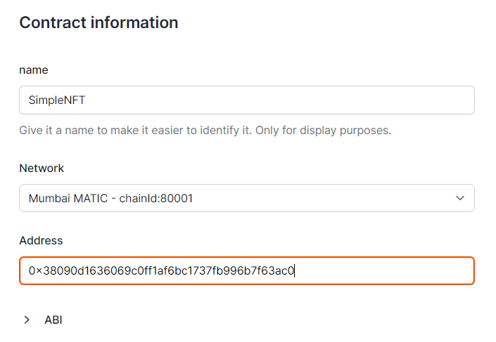
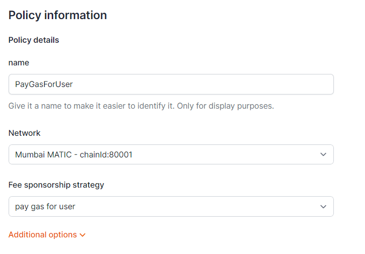
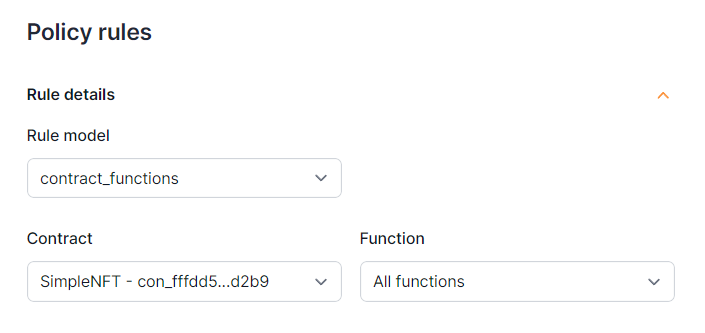
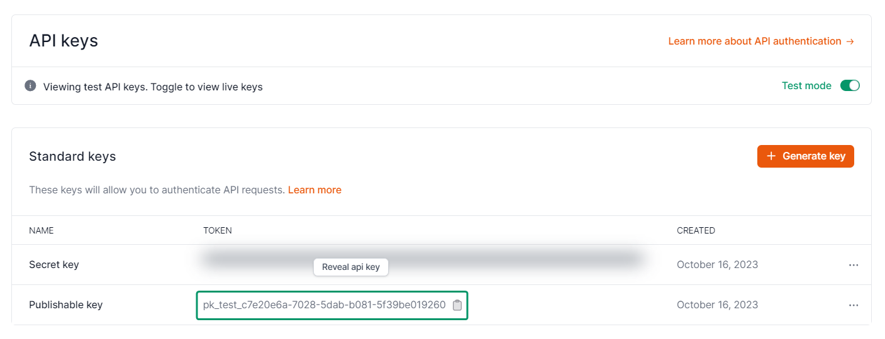
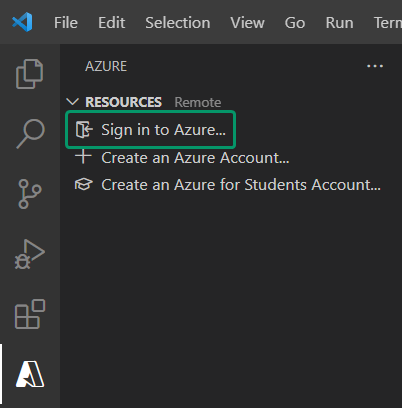
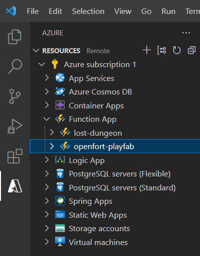
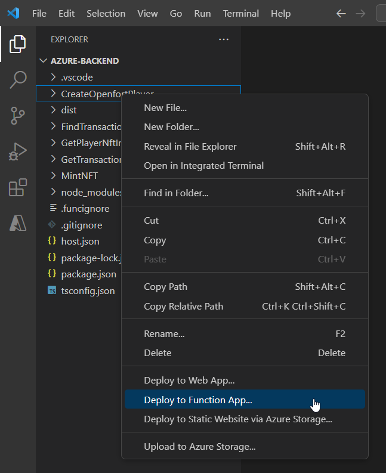
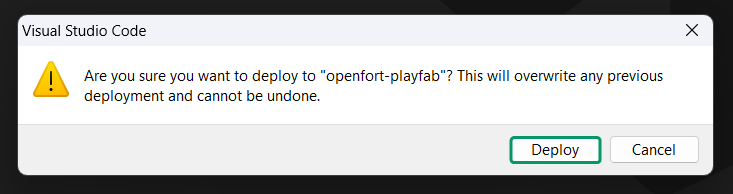

# Openfort-PlayFab Integration in Unity

## Overview
[PlayFab](https://playfab.com/) is a backend service by Microsoft for game developers, offering tools for live game management, all powered by Azure's cloud infrastructure.

In this integration, we also leverage the [Google Play Games plugin for Unity](https://github.com/playgameservices/play-games-plugin-for-unity) to handle authentication with PlayFab. This ensures a seamless and secure login experience for users on Android devices. 

By integrating the [Openfort SDK](https://github.com/openfort-xyz/openfort-node) into Azure Functions, we then create a seamless bridge to PlayFab. This connection allows Unity clients using the PlayFab Unity SDK to tap into these functions, making the entire range of Openfort functionalities readily available within the game environment.

## Prerequisites
+ [Create a PlayFab account and title](https://learn.microsoft.com/en-us/gaming/playfab/gamemanager/quickstart)
+ Set up your Azure development environment:
    + [Configure your environment](https://learn.microsoft.com/en-us/azure/azure-functions/create-first-function-vs-code-node?pivots=nodejs-model-v4#configure-your-environment)
    + [Sign in to Azure](https://learn.microsoft.com/en-us/azure/azure-functions/create-first-function-vs-code-node?pivots=nodejs-model-v4#sign-in-to-azure)
    + [Create a function app](https://learn.microsoft.com/en-us/azure/azure-functions/create-first-function-vs-code-node?pivots=nodejs-model-v4#create-the-function-app-in-azure)
+ [Sign in to dashboard.openfort.xyz](http://dashboard.openfort.xyz) and create a new project
+ [Configure Google Play Services] //TODO
+ Download or clone [sample project](https://github.com/dpradell-dev/openfort-playfab-unity-sample): 
    + Open [unity-client](https://github.com/dpradell-dev/openfort-playfab-unity-sample/tree/main/unity-client) with Unity 
    + Open [azure-backend](https://github.com/dpradell-dev/openfort-playfab-unity-sample/tree/main/azure-backend) with VS Code

## Set up Openfort

1. #### [Add a Contract](https://dashboard.openfort.xyz/assets/new)
   This sample requires a contract to run. We're using [0x38090d1636069c0ff1Af6bc1737Fb996B7f63AC0](https://mumbai.polygonscan.com/address/0x38090d1636069c0ff1Af6bc1737Fb996B7f63AC0) (NFT contract deployed in 80001 Mumbai). To follow this guide, you can use it too:

   

2. #### [Add a Policy](https://dashboard.openfort.xyz/policies/new)
   In this scenario, we aim to cover the gas fees for our users, so we set a new gas policy:

   

   Now add a rule for the policy to work for our contract:

   

3. #### [Get Publishable key](https://dashboard.openfort.xyz/apikeys)
    Copy this key, we will need it later:

    

## Deploy Azure backend
Open [azure-backend](https://github.com/dpradell-dev/openfort-playfab-unity-sample/tree/main/azure-backend) with VS Code and sign in to Azure:



Make sure you have your Function App there (in our case it's openfort-playfab):



Open the terminal and run:
```
npm install
```

In the explorer, right click on to one function and choose ***Deploy to Function App***:



Select your Function App:


Finally choose ***Deploy***:




//TODO
+ Add PlayFab title to Unity
+ Add PLAYFAB_API_KEY and PLAYFAB_SECRET_KEY to Azure
+ Register functions to Playfab title
+ Add Openfort API Key to Azure config
+ Add Openfort ContractAddress to Azure config
+ keystore

## Google Play
+ Ensure you're using Google Play SDK version 14. This specific version is necessary for [specific reasons or functionalities you're targeting].

## Conclusion

Once you've completed all the steps above, your Unity game should now be integrated with Openfort and PlayFab. Remember to test all functionalities before deploying to ensure a seamless player experience. For any issues or further queries, consider linking to a contact or support page.
