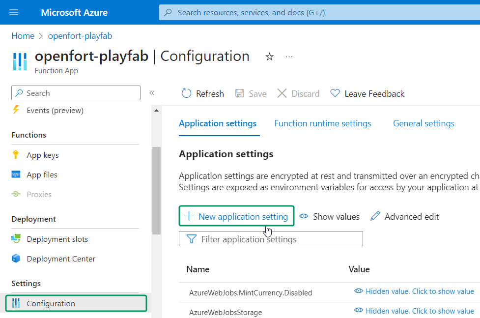
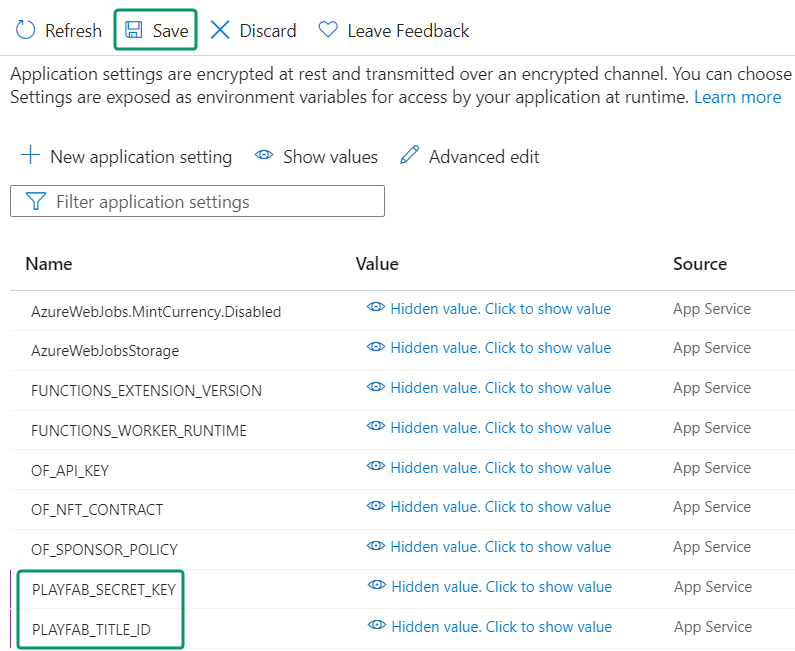
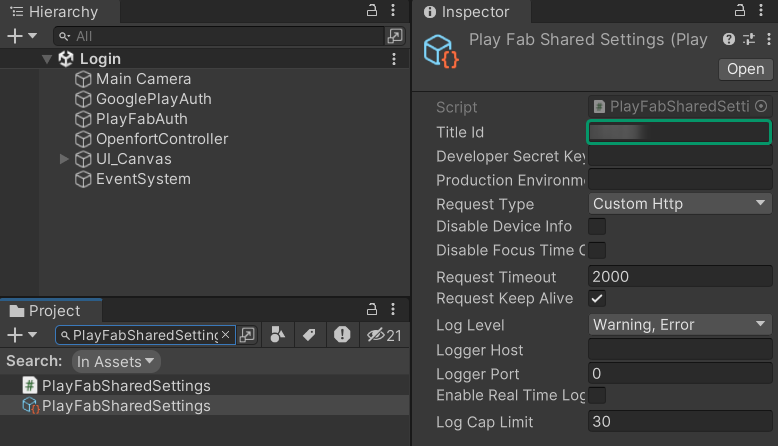

# Openfort-PlayFab Integration in Unity

## Overview
[PlayFab](https://playfab.com/) is a backend service by Microsoft for game developers, offering tools for live game management, all powered by Azure's cloud infrastructure.

In this integration, we also leverage the [Google Play Games plugin for Unity](https://github.com/playgameservices/play-games-plugin-for-unity) to handle authentication with PlayFab. This ensures a seamless and secure login experience for users on Android devices. 

By integrating the [Openfort SDK](https://github.com/openfort-xyz/openfort-node) into Azure Functions, we then create a seamless bridge to PlayFab. This connection allows Unity clients using the PlayFab Unity SDK to tap into these functions, making the entire range of Openfort functionalities readily available within the game environment.

## Application Workflow

//TODO graphic

## Prerequisites
+ [Create a PlayFab account and title](https://learn.microsoft.com/en-us/gaming/playfab/gamemanager/quickstart)
+ Set up your Azure development environment:
    + [Configure your environment](https://learn.microsoft.com/en-us/azure/azure-functions/create-first-function-vs-code-node?pivots=nodejs-model-v4#configure-your-environment)
    + [Sign in to Azure](https://learn.microsoft.com/en-us/azure/azure-functions/create-first-function-vs-code-node?pivots=nodejs-model-v4#sign-in-to-azure)
    + [Create a function app](https://learn.microsoft.com/en-us/azure/azure-functions/create-first-function-vs-code-node?pivots=nodejs-model-v4#create-the-function-app-in-azure)
+ [Sign in to dashboard.openfort.xyz](http://dashboard.openfort.xyz) and create a new project
+ Download or clone [sample project](https://github.com/dpradell-dev/openfort-playfab-unity-sample): 
    + Open [unity-client](https://github.com/dpradell-dev/openfort-playfab-unity-sample/tree/main/unity-client) with Unity 
    + Open [azure-backend](https://github.com/dpradell-dev/openfort-playfab-unity-sample/tree/main/azure-backend) with VS Code
+ Watch the [video tutorial](https://www.youtube.com/watch?v=dbLpA2YB6vU) on how to configure *Google Play Games for Unity* and apply it to [unity-client](https://github.com/dpradell-dev/openfort-playfab-unity-sample/tree/main/unity-client). Keep in mind that:
    + Google Play Games SDK is already imported to [unity-client](https://github.com/dpradell-dev/openfort-playfab-unity-sample/tree/main/unity-client)
    + No need to follow the instruction related to ***Unity Gaming Services***
    + No need to [create the script](https://youtu.be/dbLpA2YB6vU?t=1089)

## Set up Openfort

1. #### [Add a Contract](https://dashboard.openfort.xyz/assets/new)
   This sample requires a contract to run. We're using [0x38090d1636069c0ff1Af6bc1737Fb996B7f63AC0](https://mumbai.polygonscan.com/address/0x38090d1636069c0ff1Af6bc1737Fb996B7f63AC0) (NFT contract deployed in 80001 Mumbai). To follow this guide, you can use it too:

   

2. #### [Add a Policy](https://dashboard.openfort.xyz/policies/new)
   In this scenario, we aim to cover the gas fees for our users, so we set a new gas policy:

   

   Now add a rule for the policy to work for our contract:

   

## Deploy Azure backend
Open [azure-backend](https://github.com/dpradell-dev/openfort-playfab-unity-sample/tree/main/azure-backend) with VS Code and sign in to Azure:


Make sure you have your Function App there (in our case it's openfort-playfab):


Open the terminal and run:
```
npm install
```

In the explorer, right click on to one function and choose ***Deploy to Function App***:


Select your Function App:


Finally choose ***Deploy***:


Go to your [Azure Portal](https://portal.azure.com/#home) and select your Function App. You should see all the functions there:


Select one of them and choose ***Get Function Url***:


Next we will add this url (and all the others) to PlayFab in order to be able to access our Azure Functions from PlayFab.

## Set up PlayFab Title

1. #### Register Azure Functions
    Go to the [PlayFab developer dashboard](https://developer.playfab.com/), select your title and select ***Automation***:

    

    We already have our functions registered. In order to do that, select ***Register function*** and add the function name and its url:

    

    Repeat this step to register all the deployed functions.
    
2. #### Install Google Add-on
    Go to ***Add-ons*** and select ***Google***:

    

    Go to the [Google Cloud APIs Credentials dashboard](https://console.cloud.google.com/apis/credentials) and select the arrow icon of your ***OAuth Web Application Client***:

    

    Copy the ***Client ID*** and the ***Client secret***:

    

    Back to the PlayFab dashboard, paste those fields into ***Google OAuth Client ID*** and ***Google OAuth Client Secret*** and choose ***Install Google***:

    

2. #### Add PlayFab OAuth redirect URL 

    This step happens on [Google Cloud APIs Credentials dashboard](https://console.cloud.google.com/apis/credentials). Once there select your *Web application*:

    

    On ***Authorized redirect URIs*** add the following url and choose ***Save***:
    ```
    https://oauth.playfab.com/oauth2/google
    ```
    

## Set up Azure backend
Our Azure backend environment will need some environment variables from both PlayFab and Openfort so let's add those.

1. #### Add Openfort environment variables
    Go to the [Azure Portal](https://portal.azure.com/#home) and select your Function App. Under ***Configuration*** choose ***New application setting***:

    

    Fill the empty fields with:
    + Name: `OF_API_KEY`
    + Value: [Get **Secret key**](https://dashboard.openfort.xyz/apikeys)

    Repeat the process to add another application setting:
    + Name: `OF_NFT_CONTRACT`
    + Value: [Get **Contract API ID**](https://dashboard.openfort.xyz/assets)

    Repeat the process to add another application setting:
    + Name: `OF_SPONSOR_POLICY`
    + Value: [Get **Policy API ID**](https://dashboard.openfort.xyz/policies)

    You should see the configuration panel like this. Choose ***Save***:
    
    

2. #### Add PlayFab environment variables
    Go to the [PlayFab developer dashboard](https://developer.playfab.com/), select your title and choose ***Settings wheel --> Tittle settings***:

    

    Under ***API Features***, copy your ***Title ID***:

    

    Under ***Secret Keys***, copy your ***Secret key***:

    

    Go to the [Azure Portal](https://portal.azure.com/#home) and select your Function App. Under ***Configuration*** choose ***New application setting***:

    Fill the empty fields with:
    + Name: `PLAYFAB_TITLE_ID`
    + Value: [Your Title ID]

    Repeat the process to add another application setting:
    + Name: `PLAYFAB_SECRET_KEY`
    + Value: [Your Secret Key]

    You should see the configuration panel like this. Choose ***Save***:

    

## Set up Unity client
For your information, this Unity sample project already comes with:
+ [PlayFab Unity SDK](https://github.com/PlayFab/UnitySDK)
+ [Google Play Games Unity Plugin (v11.01)](https://github.com/playgameservices/play-games-plugin-for-unity) 

Open [unity-client](https://github.com/dpradell-dev/openfort-playfab-unity-sample/tree/main/unity-client) with Unity. We need to do very few things to get it running:

1. #### Set up PlayFab SDK
    In the ***Project*** tab, search for `PlayFabSharedSettings` and set your PlayFab ***Title ID***:

    

2. #### Set up Google Play Games SDK
    You should have the Google Play Games SDK set-up by following the [required tutorial](//TODOlink), but go to ***Window --> Google Play Games --> Setup --> Android setup*** to confirm you have these fields correctly filled:

    

    

    This will let us use Google Play Games to authenticate our users via PlayFab (remember [Google Add-on](https://github.com/dpradell-dev/openfort-playfab-unity-sample#install-google-add-on//TODOlink)) when our game/application is running on Android. If not, we will use PlayFab standard authentication.

## Run the game in Editor

## Build the game to Android


//TODO
+ Set up Google Play SDK (video?)

## Google Play
+ Ensure you're using Google Play SDK version 14. This specific version is necessary for [specific reasons or functionalities you're targeting].

## Conclusion

Once you've completed all the steps above, your Unity game should now be integrated with Openfort and PlayFab. Remember to test all functionalities before deploying to ensure a seamless player experience. For any issues or further queries, consider linking to a contact or support page.
